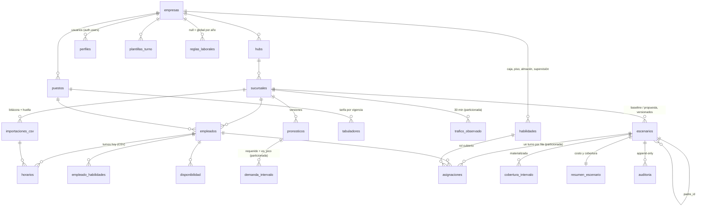

# Jornada40

Jornada40 toma la semana de turnos de una tienda (un CSV con quién trabaja
qué día y a qué hora) y devuelve el **antes y después** bajo la reforma de las
40 horas: cuánto cuesta la semana hoy, cuánto costaría con una programación
que respeta el tope elegido, cuántas horas al doble desaparecen y si la
cobertura en horas pico se mantiene. Está pensado para retail mexicano con
decenas de sucursales (el caso de referencia son 50 tiendas y ~80 personas
por tienda, operación de domingo a domingo).

Producción: https://testing-app.cesargonzalezzapata.workers.dev

## Cómo funciona

1. **Cuenta y empresa.** Al registrarse se crea la empresa; no hay datos de
   muestra. La primera pantalla pide el CSV y explica su formato
   (`public/plantillas/` trae ejemplos: una tienda, una cadena de 50 tiendas
   con 4 semanas).
2. **Tope de horas.** Antes de soltar el archivo se elige el tope semanal con
   el que se programa (48 · 46 · 44 · 42 · 40, la transición de la reforma).
   Queda guardado en la empresa y se puede afinar en Configuración.
3. **Guardar.** El archivo se lee en el navegador (papaparse), se valida fila
   por fila y se envía a Postgres **una llamada por sucursal**
   (`importar_turnos_sucursal`), que da de alta o actualiza colaboradores y
   turnos en una transacción. 85 mil turnos de 50 tiendas tardan ~40 s.
4. **Panel de inmediato.** En cuanto los turnos están guardados el panel abre
   en la primera sucursal y semana del archivo. Una cola en segundo plano
   programa todas las sucursal-semanas (2 tiendas a la vez) y una barra
   flotante muestra el avance; el Diagnóstico se actualiza solo conforme
   llegan propuestas. Si la pestaña se cierra a medias, al volver el panel
   ofrece terminar lo que falte.
5. **Antes y después.** Por sucursal y semana: costo laboral hoy contra
   propuesta, horas al doble, colaboradores fuera de norma, cobertura pico,
   cobertura por intervalo de 30 min, quién cede y quién recibe horas, y la
   tabla persona por persona. Reportes agrega toda la empresa.

Volver a soltar el mismo archivo no repite nada: cada carga guarda una huella
del contenido por sucursal y las que ya están idénticas se omiten.

## Tecnología

| Capa | Tecnología | Por qué |
|---|---|---|
| Web | Next.js 16 (App Router, React 19, TypeScript 5) | Componentes de servidor para el panel con datos por petición; `proxy.ts` renueva la sesión; Web Workers para el motor sin bloquear la UI. |
| UI | Tailwind CSS 4, shadcn/ui, Recharts, lucide-react | Sistema visual único para marketing y panel (`docs/ux/`). |
| Datos | Supabase: PostgreSQL 17, Auth, PostgREST, RLS | Integridad transaccional de las asignaciones (`EXCLUDE`, *constraint triggers*), particionado por semana, RLS multi-empresa, funciones junto a los datos. |
| Motor | TypeScript puro (`src/lib/motor`) | Corre en el navegador (Web Worker) y en scripts Node con el mismo código; sin solver externo. |
| Despliegue | OpenNext → Cloudflare Workers (`wrangler.jsonc`) | Edge global, sin servidor que mantener; `npm run deploy`. |
| Scripts | tsx, papaparse | Generador de datos sintéticos calibrados y corrida del motor por lotes. |

## Estructura del repositorio

```
src/app/                 rutas: marketing (/), login/registro, dashboard (layout con datos por sesión)
src/components/dashboard  panel: onboarding, importar-y-programar, estado-cola (cola en segundo plano),
                          comparacion, cobertura-semana, deltas-persona, diagnostico-tabla, tabs/
src/lib/importacion/      contrato del CSV (parse), destino, importar (RPC por sucursal, huella), flujo
src/lib/programacion/     cola.ts: programación en segundo plano a nivel de módulo
src/lib/motor/            motor: pronóstico, requerimiento, optimizar, evaluar, baseline, programar.ts
src/lib/reacomodo/        reacomodo simple de horas (mismo algoritmo que public.reacomodar_semana)
src/lib/datos/            lectura del panel y del reporte (Supabase → DatosPanel / DatosReporte)
supabase/migrations/      0002 esquema · 0003 RLS · 0004 vistas · 0005 reacomodo · 0006–0007 programación
                          0008 parámetros de empresa · 0009 huella · 0010 timeout · 0011 auditoría
                          0012 semanas_sin_propuesta · 0013–0014 importar_turnos_sucursal
scripts/sintetico/        generador y cargador de la cadena sintética (50 tiendas)
scripts/motor/            corrida por lotes del motor, verificación contra la base, reporte
docs/                     arquitectura, calibración de datos, resultados, evaluaciones UX
public/plantillas/        CSV de ejemplo
```

## Puesta en marcha

```bash
npm install
npm run dev            # http://localhost:3000
npm run build && npm start
npm run lint
npm run deploy         # OpenNext build + Cloudflare Workers
npm run sintetico:generar   # cadena sintética (scripts/sintetico/salida/)
npm run sintetico:cargar    # la sube a Supabase con la cuenta indicada en .env.local
npm run motor               # programa tienda-semanas por lotes y verifica contra la base
```

Variables en `.env.local` (nunca se versionan): `NEXT_PUBLIC_SUPABASE_URL`,
`NEXT_PUBLIC_SUPABASE_PUBLISHABLE_KEY`, `CLOUDFLARE_ACCOUNT_ID`,
`CLOUDFLARE_API_TOKEN`, y para los scripts `SINTETICO_EMAIL` /
`SINTETICO_PASSWORD`. Las migraciones se aplican en orden numérico
(`supabase/README.md` documenta cada una y el contrato del CSV). En Supabase
hay que fijar Site URL y Redirect URL del proyecto a la URL de producción para
que el correo de confirmación no apunte a localhost.

## Decisiones de diseño

Las decisiones de fondo, con alternativas descartadas, están en
`docs/arquitectura.md` (§2). Resumen y decisiones tomadas después al operar
con 50 tiendas:

- **Postgres como sistema de registro y de reglas.** Las reglas laborales no
  se validan sólo en la app: un turno que viole el tope, la jornada diaria,
  el descanso entre turnos, el día de descanso, la disponibilidad o la
  habilidad no puede existir en la base (ver trazabilidad abajo).
- **Intervalos de 30 minutos.** Los contadores de tráfico y los turnos reales
  operan a la media hora; 15 min cuadruplica el costo sin cambiar decisiones y
  60 min esconde los picos de comida y cierre.
- **Motor heurístico en TypeScript, formulación MILP documentada.** Voraz +
  búsqueda local, determinista, < 2 s por tienda-semana; la interfaz permite
  cambiar a un solver sin tocar el esquema. Corre en el navegador (Web Worker)
  para que el servidor no cargue con 200 optimizaciones.
- **Dos modos de demanda.** Con tráfico observado, pronóstico estacional y
  requerimiento por productividad (ahorros del orden del 45 % en el caso
  sintético). Sin tráfico, "cobertura actual": la demanda de cada intervalo y
  habilidad es la que hoy cubre el horario importado, así la propuesta
  conserva la curva de cobertura y el ahorro (11–13 %) viene sólo de las horas
  extra eliminadas. Nunca se reduce plantilla por inferencia.
- **Escenarios inmutables y versionados.** Baseline y propuesta son escenarios
  completos; uno publicado no se edita, se crea otro con `padre_id`. Comparar
  antes y después es comparar dos escenarios de la misma sucursal-semana.
- **Guardar rápido, programar en el fondo.** El panel abre al terminar de
  guardar; la cola programa después. Se probó guardar sucursales en paralelo
  y programar 3 a la vez: en la instancia base de Supabase cada llamada pasaba
  de ~0.5 s a 5–12 s por contención, así que el guardado va en serie y la cola
  programa 2 sucursales a la vez con reintento ante timeouts.
- **Cargas idempotentes.** Huella SHA-256 por sucursal en `importaciones_csv`;
  re-importar actualiza turnos por `(empleado, fecha, hora_inicio)` y omite
  sucursales ya cargadas iguales.
- **Lo que el panel lee son resúmenes.** La UI consulta `resumen_escenario`,
  `v_ahorro_escenario` y `reporte_ejecutivo`; nunca agrega asignaciones en
  interactivo. El reporte ejecutivo se pide sólo al abrir su pestaña.
- **Auditoría proporcional.** `escenarios` y toda actualización o baja de
  `asignaciones` se auditan; los *inserts* de asignaciones no, porque el
  escenario publicado e inmutable ya es la traza y mil filas por escenario
  duplicaban el volumen escrito.

## Matemática del reparto de horas

Hay dos algoritmos y conviene no confundirlos. El **reacomodo** reparte
horas entre personas (cuántas horas trabaja cada quien) y es lo que el panel
muestra como columna "Reacomodada" mientras una semana no tiene propuesta. El
**optimizador** decide turnos concretos (quién, qué día, de qué hora a qué
hora, cubriendo qué habilidad) y es lo que produce la propuesta publicada.
El reacomodo es exacto y se ejecuta en milisegundos; el optimizador es una
heurística con reglas duras y un presupuesto de tiempo.

### Reacomodo: reparto equitativo bajo el tope

Código: `src/lib/reacomodo/index.ts` (TypeScript) y
`public.reacomodar_semana` en `supabase/migrations/0005_reacomodo.sql`
(PL/pgSQL). Son la misma regla y dan el mismo resultado al décimo de hora.

**Entrada.** Para cada colaborador `i` de la sucursal en la semana:
`h_i` horas que trabaja hoy, opcionalmente `c_i` horas de contrato. Un tope
`T` (48 → 40 h) y, opcionalmente, un margen `m` sobre el contrato.

**Límite individual.** Nadie puede subir de

```
L_i = T                                   si no hay margen o no hay contrato
L_i = min(T, max(c_i, h_i) + m)           si hay margen y contrato
```

**Paso 1, ceder.** Quien excede el tope baja exactamente al tope; lo que
suelta va a una bolsa común `B`:

```
B = Σ_i max(h_i − T, 0)         h_i ← min(h_i, T)
```

`B` se redondea hacia abajo a múltiplos de 0.5 h (los turnos se programan a
la media hora); la fracción que sobra se cuenta como "sin cubrir".

**Paso 2, deuda de contrato.** Primero se paga a quien está por debajo de su
contrato, de mayor déficit a menor: `d_i = max(0, min(c_i, L_i) − h_i)`,
y cada quien recibe `min(d_i, B)` hasta agotar la bolsa. Así el reparto
respeta lo pactado antes de repartir "lo que sobra".

**Paso 3, nivelación (water-filling).** Mientras quede bolsa, cada bloque de
0.5 h va a la persona que **menos horas tiene** y todavía cabe en su límite
(`h_i + 0.5 ≤ L_i`). Los empates se resuelven por orden de lista, que es
estable (apellido, nombre), así que el resultado es determinista.

**Salida.** `reacomodada_i`, `delta_i = reacomodada_i − h_i` y el rol
`cede / recibe / igual`; y el balance: horas excedentes, absorbidas, sin
cubrir, y `vacantes = ⌈sin_cubrir / T⌉`.

**Propiedades.**

- *Ningún colaborador queda arriba del tope* (todos ceden hasta `T`, nadie
  sube más allá de `L_i ≤ T`).
- *Se conservan las horas*: `Σ reacomodada_i + sin_cubrir = Σ h_i`. La
  demanda no se recorta: si la plantilla no alcanza para absorber el exceso,
  sobran horas y se sugieren vacantes, nunca se "pierden" en silencio.
- *Equidad max-min*: el paso 3 es el algoritmo de llenado de agua. Al
  terminar, no existe ningún par `(i, j)` tal que `i` haya recibido un bloque
  y `j` tenga menos horas y espacio libre: el vector final maximiza el mínimo
  de horas (y, entre los que empatan en mínimo, el siguiente mínimo, y así
  sucesivamente: orden leximin) sujeto a los límites `L_i`. Es la misma
  noción de justicia que usa el reparto de ancho de banda en redes.
- *Determinista y barato*: `O(n + B/0.5 · n)`, decenas de miles de
  operaciones para una tienda de 80 personas; corre en el servidor al pintar
  el panel.

**Ejemplo.** Tope `T = 40`, sin margen. Cuatro colaboradores:

| | Hoy | Contrato | Cede / recibe | Reacomodada |
|---|---|---|---|---|
| A | 52 | 48 | −12 | 40 |
| B | 48 | 48 | −8 | 40 |
| C | 30 | 40 | +10 (deuda de contrato) | 40 |
| D | 36 | — | +4 (nivelación, 8 bloques de 0.5 h) | 40 |

Bolsa: 12 + 8 = 20 h. Paso 2 paga las 10 h de deuda de C. Paso 3 lleva a D
de 36 a 40 con 4 h; quedan 6 h que ya no caben en nadie (todos están en el
tope): `sin_cubrir = 6`, `vacantes = ⌈6/40⌉ = 1`. Total antes 166 h = total
después 160 h + 6 h sin cubrir.

### Optimizador: de horas a turnos

Código: `src/lib/motor/optimizar.ts`; formulación completa y alternativas en
`docs/arquitectura.md` §6. El reacomodo dice *cuántas* horas; el optimizador
dice *cuáles*, porque la cobertura se necesita por intervalo de 30 min y por
habilidad (caja, piso, almacén, supervisión).

**Objetivo.** Minimizar

```
Σ costo(e, p, d) · x[e,d,p]  +  M · Σ u[i,h]  +  λ · Σ o[i]
```

donde `x[e,d,p] = 1` si el empleado `e` trabaja la plantilla de turno `p` el
día `d`; `costo` = horas × tarifa del puesto (+ prima dominical si `d` es
domingo); `u[i,h]` es el déficit de personas en el intervalo `i` para la
habilidad `h` y `o[i]` el exceso; `M ≫ λ`, de modo que cubrir la demanda
(sobre todo en pico) domina y el sobrestaffing se penaliza con su costo real
(λ = tarifa media ponderada × 0.5 h).

**Reglas duras** (nunca se violan; se revalidan al final con código
independiente y las vuelve a comprobar Postgres al guardar): un turno por
empleado-día; Σ horas ≤ tope y ≤ `max_horas_semana`; horas por día ≤
`max_horas_dia`; ≤ `max_dias_semana` días; descanso ≥
`descanso_entre_turnos_horas` entre turnos; ventanas de disponibilidad;
habilidad del rol en las del empleado; sin traslapes.

**Heurística.**

1. *Construcción voraz.* Mientras haya déficit, se elige la terna (día,
   plantilla, habilidad) con mayor puntuación
   `(déficit ponderado que cubre − 0.1 · exceso) / (horas + K)`, donde los
   intervalos pico pesan 50 veces más, y se asigna al empleado elegible más
   barato, prefiriendo que su puesto coincida con la habilidad, la
   continuidad (misma plantilla que el día anterior) y **menos horas
   acumuladas**: este último desempate es lo que reparte las horas entre
   personas de igual tarifa en vez de cargar a unas pocas. `K` regula qué
   recurso escasea (horas o empleados-día) y se prueban varios valores
   (multi-arranque determinista), la mitad con "reserva" de capacidad para
   los picos de otros días.
2. *Búsqueda local*, hasta no mejorar o agotar el presupuesto (3 s): quitar
   turnos cuya retirada no crea déficit; mover un turno a otra plantilla,
   empleado o habilidad del mismo día, o a otro día del mismo empleado, si
   baja el objetivo; y volver a construir por si se liberó capacidad.
3. Lo que queda sin empleado elegible se reporta como **vacantes**
   (horas-turno sin cubrir). Nunca se rompe el tope para cubrirlo.

**Cómo se mide el resultado.** `evaluar.ts` replica al centavo la fórmula de
`resumir_escenario`: horas regulares hasta el tope, dobles hasta
`horas_dobles_max` al `factor_doble`, triples al `factor_triple`, prima
dominical, y sobrestaffing valuado a la tarifa media. Con ese mismo cálculo
se comparan baseline y propuesta en `v_ahorro_escenario`.

## Arquitectura de la base de datos

PostgreSQL 17 en Supabase, un solo esquema `public`, multi-empresa por RLS.
El detalle de cada migración, columna y política está en `supabase/README.md`
y el porqué de las decisiones en `docs/arquitectura.md` §2–3; esto es el mapa.

### Dominios y relaciones



| Dominio | Tablas | Para qué |
|---|---|---|
| Multi-empresa | `empresas`, `hubs`, `sucursales`, `perfiles` | Raíz del *tenant*. `perfiles.id` = `auth.users.id`; el trigger `handle_new_user` crea empresa, hub "Principal" y perfil `owner` al registrarse. `empresas` guarda `tope_objetivo` y `costo_hora_default`. |
| Personas y turnos de hoy | `empleados`, `horarios`, `importaciones_csv` | Lo que llega en el CSV. `horarios` es una fila por segmento de turno con `horas` generada; `importaciones_csv` registra cada carga con conteos, errores por fila y una `huella` SHA-256 del contenido por sucursal. |
| Catálogo | `habilidades`, `puestos`, `tabuladores`, `plantillas_turno`, `reglas_laborales`, `empleado_habilidades`, `disponibilidad` | Parámetros del motor. Las reglas laborales tienen una fila global por año de la reforma (48 → 40) y opcionalmente una por empresa. `topes_semanales` es el catálogo legal por año. |
| Demanda | `trafico_observado`, `pronosticos`, `demanda_intervalo` | Requerimiento de personas por intervalo de 30 min y habilidad, con la marca `es_pico`. Sin tráfico, el motor escribe una demanda "cobertura actual". |
| Escenarios | `escenarios`, `asignaciones`, `cobertura_intervalo`, `resumen_escenario`, `auditoria` | Una programación completa de una sucursal-semana. El baseline se materializa desde `horarios`; la propuesta la escribe el motor. Los resúmenes son lo único que lee la interfaz. |

### Principios

- **Un solo eje de aislamiento.** Toda fila cuelga de `hubs.empresa_id`, y
  cada política RLS lo comprueba por la cadena hub → sucursal → empleado o
  escenario contra `empresa_actual()` (función `security definer` que lee el
  perfil del usuario). `anon` no tiene privilegios sobre nada; `authenticated`
  tiene `select/insert/update/delete` filtrados. Roles: `owner`, `admin`
  (catálogos y sucursales), `gerente` (turnos y escenarios), lectura.
- **Las reglas laborales viven en la base.** `asignaciones` tiene una
  restricción `EXCLUDE` con `tstzrange` (dos turnos del mismo empleado no se
  traslapan, por construcción) y un *constraint trigger* diferido,
  `trg_asignaciones_validar`, que al `COMMIT` valida la semana completa:
  jornada diaria, tope semanal, días trabajados, descanso entre turnos,
  disponibilidad y habilidad. Por eso el motor inserta la semana de un
  empleado en una sola transacción.
- **Escenarios inmutables.** `publicado` sólo puede pasar a `archivado`
  (`trg_escenarios_proteger`); sus asignaciones no admiten `update` ni
  `delete` (`trg_asignaciones_proteger`). Una corrección es un escenario
  nuevo con `padre_id`. `auditoria` es append-only y guarda antes/después en
  JSONB de `escenarios` y de toda actualización o baja de `asignaciones`.
- **Particionado por semana.** `trafico_observado`, `demanda_intervalo` y
  `asignaciones` se particionan por rango de `semana_iso` (trimestres
  `_2026q1`…`_2026q4` y `_default`); índices, triggers y RLS se heredan. Un
  trimestre nuevo es un `create table … partition of …`.
- **La interfaz lee resúmenes, no detalle.** `resumir_escenario` materializa
  `cobertura_intervalo` y `resumen_escenario`; el panel consulta
  `v_ahorro_escenario` y `reporte_ejecutivo`, nunca agrega `asignaciones` en
  interactivo. Con 50 tiendas, el resumen de semanas se pide sólo para la
  sucursal activa.
- **Cálculo junto a los datos, con la misma fórmula en dos lugares.** El costo
  (regulares, dobles, triples, prima, sobrestaffing) lo calcula Postgres en
  `v_costo_empleado_semana`; el motor lo replica en TypeScript y los scripts
  verifican que coinciden al centavo.

### Puntos de entrada

| Objeto | Tipo | Qué hace |
|---|---|---|
| `importar_turnos_sucursal(sucursal, archivo, huella, totales, filas jsonb, errores, importacion?, cerrar?)` | función | Una llamada por sucursal: abre la bitácora, hace *upsert* de empleados por `(sucursal, clave_externa)` y de horarios por `(empleado, fecha, hora_inicio)`, y cierra la carga, en una transacción y con la RLS del usuario. |
| `materializar_baseline(sucursal, semana, reglas?)` | función | Crea y publica el escenario `baseline` a partir de `horarios`. |
| `resumir_escenario(escenario)` | función | Regenera cobertura por intervalo y el resumen de costo y cobertura pico. Se llama al publicar. |
| `v_costo_empleado_semana`, `v_asignacion_horas_semana` | vistas | Horas y costo por escenario-empleado con las reglas del escenario. |
| `v_ahorro_escenario` | vista | Último baseline vs última propuesta publicados por sucursal-semana: costos, ahorro, desglose, cobertura pico, déficit. |
| `reporte_ejecutivo(semana?)` | función | Agregado por semana de toda la empresa. |
| `v_horas_semana`, `v_resumen_sucursal_semana`, `resumen_sucursal` | vistas y función | Diagnóstico de "hoy": horas por persona y semana, horas al doble y fuera de norma contra el tope legal del año. |
| `reacomodar_semana`, `resumen_reacomodo` | funciones | El reparto equitativo de horas de la sección anterior, en PL/pgSQL (la app usa la versión TypeScript, idéntica). |
| `semanas_sin_propuesta()` | función | Sucursal-semanas con turnos cargados y sin propuesta publicada, para retomar la programación en segundo plano. |
| `empresa_actual()`, `rol_actual()`, `es_admin()`, `puede_editar()` | funciones | Base de todas las políticas RLS. |

Todo lo que expone la API es `security invoker`: aplica las políticas del
usuario que llama. Las particiones no son accesibles directamente por la API.

### Flujo de escritura de una semana

```
CSV → importar_turnos_sucursal (empleados + horarios + bitácora, 1 transacción por sucursal)
    → materializar_baseline                       escenario baseline publicado
    → motor: insert escenarios (propuesta, borrador) + asignaciones en lotes de 500
        └ EXCLUDE + trg_asignaciones_validar al COMMIT de cada lote
    → update escenarios set estado = 'publicado'  (inmutable desde aquí)
    → resumir_escenario                           cobertura_intervalo + resumen_escenario
    → v_ahorro_escenario / reporte_ejecutivo      lo que lee el panel
```

### Migraciones

| Migración | Contenido |
|---|---|
| `0002_esquema_base` | Multi-empresa, perfiles, empleados, horarios, importaciones, topes legales; `handle_new_user`. |
| `0003_rls` | Políticas RLS y funciones auxiliares de rol. |
| `0004_vistas_y_semilla_topes` | `v_horas_semana`, `v_resumen_sucursal_semana`, `tope_semanal`, `resumen_sucursal`; topes 2025–2030. |
| `0005_reacomodo` | `reacomodar_semana`, `resumen_reacomodo`. |
| `0006_programacion` | Catálogo, demanda, escenarios, asignaciones particionadas, triggers de validación, inmutabilidad y auditoría, RLS de todo lo nuevo. |
| `0007_vistas_programacion` | Costo, baseline, `resumir_escenario`, ahorro y reporte ejecutivo. |
| `0008_empresas_parametros` | `tope_objetivo` y `costo_hora_default` por empresa. |
| `0009_importaciones_huella` | Huella de contenido por carga (reanudación idempotente). |
| `0010_timeout_consultas` | `statement_timeout` de `authenticated` a 15 s. |
| `0011_auditoria_asignaciones` | La auditoría de asignaciones deja de registrar *inserts*. |
| `0012_semanas_sin_propuesta` | Lista de sucursal-semanas pendientes de programar. |
| `0013`–`0014_importar_turnos_sucursal` | Importación de una sucursal en una llamada, con bitácora incluida. |

## Nota de trazabilidad de restricciones

Cada restricción tiene una fuente, un parámetro y un punto donde se hace
cumplir. Ninguna es una constante escondida en el código: viven en
`reglas_laborales` (una fila global por año de la reforma y, si hace falta,
una por empresa) y el motor las lee de ahí.

| Restricción | Fuente | Parámetro | Dónde se hace cumplir | Qué pasa si se viola |
|---|---|---|---|---|
| Tope semanal (48 → 40 h) | Reforma LFT, transición 2026–2030; tope elegido por la empresa | `escenarios.tope_semanal`, `empleados.max_horas_semana`, `empresas.tope_objetivo` | Motor (`validarReglasDuras`, optimizador) y trigger diferido `trg_asignaciones_validar` al `COMMIT` | `check_violation` "Tope semanal excedido: … suma … h (tope … h)"; la propuesta no se guarda |
| Jornada diaria máxima | LFT art. 61 (8 h diurna) | `reglas.max_horas_dia`; `check` ≤ 12 h por turno | Motor y trigger | "Jornada diaria excedida: …" |
| Día de descanso semanal | LFT art. 69 | `reglas.max_dias_semana` = 6 | Motor y trigger | "Día de descanso semanal: … trabaja … días" |
| Descanso entre turnos | Política de empresa con base en art. 69 | `reglas.descanso_entre_turnos_horas` = 12 | Motor y trigger (también contra escenarios publicados de la misma semana) | "Descanso entre turnos insuficiente: …" |
| Sin traslape de turnos | Consistencia física | — | `EXCLUDE USING gist` en `asignaciones` (constraint, no trigger) | Error de exclusión al insertar |
| Disponibilidad del colaborador | Datos del colaborador | `disponibilidad` (ventanas por día) | Motor y trigger | "Fuera de disponibilidad: …" |
| Habilidad para el puesto | Catálogo de la empresa | `empleado_habilidades` (con vigencia) | Motor y trigger | "Habilidad no vigente: …" |
| Horas extra y prima | LFT arts. 67–68 (9 h al 200 %, resto al 300 %), art. 71 (25 % dominical) | `reglas.horas_dobles_max`, `factor_doble`, `factor_triple`, `prima_dominical_pct` | `v_costo_empleado_semana` en Postgres; `evaluar.ts` en el motor replica la fórmula al centavo | No es una prohibición: se valúa y se muestra como costo |
| Cobertura en picos | Objetivo del brief: sin subdotación en horas pico | `demanda_intervalo.es_pico` (P80 del requerimiento) | Optimizador (penalización); `cobertura_intervalo` y `v_subdotacion_pico` la miden | Se reporta como déficit de horas pico y vacantes sugeridas, nunca se oculta |
| Inmutabilidad | Trazabilidad | estado `publicado` / `archivado` | `trg_escenarios_proteger`, `trg_asignaciones_proteger`, `auditoria` sólo `INSERT` | "El escenario … está publicado y es inmutable" |

**Cómo se reconstruye una cifra.** Cada número del panel y del reporte se
sigue hacia atrás sin pasos manuales:

```
CSV (fila, sucursal)
  → importaciones_csv (archivo, huella, conteos, errores por fila)
  → horarios (origen = 'csv', importacion_id)                ← "hoy"
  → escenario baseline (materializar_baseline)  ─┐
  → escenario propuesta (motor, versión n)       ├→ asignaciones (una fila por turno)
                                                 │    → v_asignacion_horas_semana → v_costo_empleado_semana
                                                 │    → cobertura_intervalo (por intervalo de 30 min)
                                                 └→ resumen_escenario (resumir_escenario)
  → v_ahorro_escenario (baseline vs propuesta de la misma sucursal-semana)
  → reporte_ejecutivo (agregado por empresa y semana)
```

`select * from asignaciones where escenario_id = …` reproduce el costo de un
escenario con las fórmulas de `docs/arquitectura.md` §7; `scripts/motor`
verifica que el total calculado en TypeScript coincide con el de Postgres al
peso para cada tienda-semana (400/400 en `docs/reporte-resultados.md` §8).
Los parámetros usados por cada propuesta quedan en el escenario
(`tope_semanal`, `reglas_id`, `pronostico_id`, `parametros`), de modo que una
propuesta vieja se lee con las reglas de su momento aunque las reglas cambien.

## Documentación relacionada

- `docs/arquitectura.md` — ERD, decisiones y alternativas, formulación del
  motor, cálculo del ahorro, escalado a 50 tiendas.
- `docs/calibracion-datos.md` — supuestos de la cadena sintética (salarios,
  tráfico, productividad, mezcla de puestos).
- `docs/reporte-resultados.md` — resultados sobre 50 tiendas × 4 semanas,
  evidencia de cobertura en picos y verificación en la base.
- `supabase/README.md` — esquema, RLS, cada migración, contrato del CSV.
- `src/lib/motor/README.md` y `scripts/motor/README.md` — el motor en la app y
  por lotes.
- `docs/ux/` — principios de interfaz y evaluaciones.

## Límites conocidos

- La cola de programación vive en la pestaña abierta: si se cierra, el panel
  ofrece retomar, pero no hay un trabajador en servidor.
- Sin tráfico observado la demanda es la cobertura actual; el modo con
  pronóstico requiere cargar `trafico_observado` (todavía sin pantalla de
  carga propia).
- Turnos que cruzan medianoche no generan plantilla y su cobertura después de
  las 24:00 se ignora.
- No hay pantalla para borrar semanas o sucursales; la baja se hace archivando
  escenarios desde la base.
