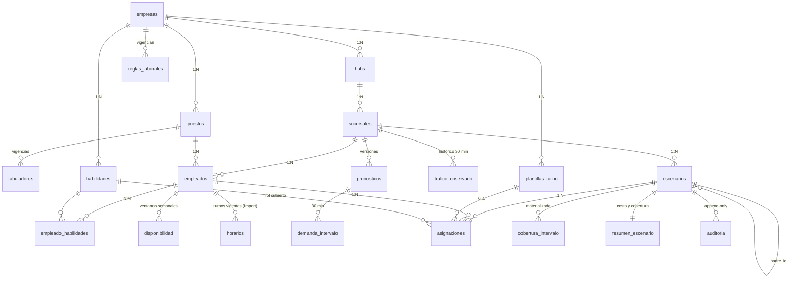

# Jornada40 · Arquitectura de programación de turnos bajo tope de 40 h

> Documento de diseño (base de datos y arquitectura primero). Las decisiones
> están justificadas y se listan las alternativas descartadas. El DDL
> ejecutable vive en `supabase/migrations/0006_programacion.sql` y
> `0007_vistas_programacion.sql`; el generador de datos sintéticos en
> `scripts/sintetico/`; el motor en `scripts/motor/`; el reporte de resultados
> en `docs/reporte-resultados.md`.

## 1. Contexto y supuestos fijos

| Supuesto | Valor |
|---|---|
| Tiendas | 50, operación domingo a domingo |
| Plantilla | ~80 FTE por tienda (rango 65–95) |
| Horario de tienda | 09:00–21:00 (departamental tipo Coppel); parametrizable por sucursal |
| Entradas | tráfico de clientes, ventas históricas, plantilla actual, turnos vigentes (CSV) |
| Tope duro | 40 h por empleado y semana ISO (parámetro del escenario; 48/46/44/42/40 por año según la reforma) |
| Datos | sintéticos, calibrados sobre retail mexicano; ver `docs/calibracion-datos.md` |
| Objetivo | ahorro ≥ 8 % del costo laboral total (extras + sobrestaffing) sin subdotación en picos |

Marco legal aplicado (LFT): jornada máxima diaria 8 h diurna (art. 61), un día
de descanso por cada seis de trabajo (art. 69), prima dominical 25 % (art. 71),
horas extra: hasta 9 h a la semana al 200 % y el resto al 300 % (arts. 67–68).
El descanso mínimo entre turnos (12 h) y el máximo de 6 días trabajados por
semana son política de la empresa con base en el art. 69; ambos son parámetros
en `reglas_laborales`, no constantes del código.

## 2. Decisiones de diseño (y alternativas descartadas)

### 2.1 Motor de base de datos: PostgreSQL 17 (Supabase)

Elegido por: `EXCLUDE` con `tstzrange` (traslapes imposibles por
construcción), *constraint triggers* diferibles (validación de reglas
agregadas por semana al final de la transacción), particionado declarativo,
funciones en PL/pgSQL para el cómputo de costo y cobertura junto a los datos,
RLS multi-empresa ya existente. Descartados: MySQL (sin exclusion
constraints ni rangos), SQLite (sin particionado ni concurrencia para 50
tiendas), un almacén columnar (BigQuery/ClickHouse) para todo el sistema: es
excelente para reportería pero no para integridad transaccional de
asignaciones; se contempla como destino de exportación futura, no como
sistema de registro.

### 2.2 Granularidad temporal: intervalos de 30 minutos

- Los contadores de tráfico de retail reportan por hora o por 15 min; la
  demanda se agrega a 30 min sumando tráfico y ventas del intervalo.
- Los turnos inician a la hora o a la media (operación real); 15 min no cambia
  la decisión de programación y cuadruplica el costo del motor.
- 60 min esconde el pico de comida (13:30–15:00) y el de cierre (18:30–20:30).

Volumen a escala (50 tiendas × 12 h abiertas × 7 días × 52 semanas):

| Tabla | 30 min (elegido) | 15 min | 60 min |
|---|---|---|---|
| `demanda_intervalo` (por versión de pronóstico) | 168 filas/tienda-semana → **436,800/año** | 873,600/año | 218,400/año |
| `asignaciones` (por escenario) | ~80 FTE × 5.5 turnos = 440/tienda-semana → **1.14 M/año** | igual (son turnos, no intervalos) | igual |
| `cobertura_intervalo` (materializada por escenario) | 168/tienda-semana → 436,800/año por escenario | 873,600 | 218,400 |

Las asignaciones son **turnos** (`inicio`, `fin`), no filas por intervalo: la
cobertura se calcula con solapamiento de rangos y se materializa una vez por
escenario. `demanda_intervalo` y `asignaciones` se particionan por rango de
`semana_iso` (trimestral) para podar por semana y archivar particiones
completas; con 3–4 escenarios/año son ~4 M filas de asignaciones, ~1.7 M de
demanda y ~1.7 M de cobertura: bien dentro de Postgres sin más ingeniería.
Los resúmenes por tienda-semana (`resumen_escenario`) son la capa que consulta
la UI; nunca se agrega sobre asignaciones en interactivo.

### 2.3 Motor de optimización: híbrido (construcción voraz + búsqueda local), formulación MILP documentada

El problema completo (asignar turnos de plantillas a 80 empleados × 7 días ×
24 intervalos con cobertura por habilidad) es un MILP de ~80 × 7 × 12
plantillas ≈ 6,700 binarias por tienda-semana. Se documenta la formulación
(§6) porque es el contrato de qué se optimiza; la implementación entregada es
una heurística determinista en TypeScript (sin dependencias de solver) que
resuelve una tienda-semana en < 2 s y 50 tiendas en < 2 min en un solo
proceso. Descartados: MILP con CBC/HiGHS vía WASM (viable, pero añade un
binario de 10 MB al pipeline y tiempos de 20–90 s por tienda-semana sin
garantía de mejora frente a la heurística en este tamaño); programación por
restricciones (OR-Tools no tiene runtime en el stack). La interfaz del motor
(`resolver(entrada) → salida`) permite sustituir la heurística por un solver
sin tocar el esquema.

### 2.4 Escenarios y versionado: *append-only*

Un `escenario` es inmutable una vez `publicado`; una corrección es un nuevo
escenario con `padre_id`. Toda escritura en `escenarios` y `asignaciones`
deja una fila en `auditoria` (`antes`/`despues` en JSONB, usuario, momento);
la tabla sólo admite `INSERT`. Descartado: versionado por columnas
`valid_from/valid_to` en cada tabla (temporal tables): más flexible pero
complica todas las consultas y las políticas RLS; el dominio (comparar
baseline contra propuesta) se modela mejor como escenarios completos.

### 2.5 Dónde vive cada cómputo

| Cómputo | Dónde | Modo |
|---|---|---|
| Ingesta CSV (tráfico, ventas, plantilla, turnos vigentes) | app (papaparse) → PostgREST | interactivo, por archivo |
| Agregación de demanda a 30 min y pronóstico | `scripts/motor` (TS) | batch nocturno por tienda-semana |
| Requerimiento de personal por intervalo | `scripts/motor` (TS) | batch |
| Materializar baseline desde `horarios` | SQL (`materializar_baseline`) | batch |
| Optimización de la propuesta | `scripts/motor` (TS) | batch (< 2 s / tienda-semana) |
| Validación de reglas duras | Postgres (constraint triggers) | al insertar, siempre |
| Costo, cobertura, ahorro | Postgres (vistas + `resumir_escenario`) | batch al publicar; lectura interactiva de `resumen_escenario` |
| Reporte ejecutivo | Postgres (`reporte_ejecutivo`) + UI | interactivo |

Contratos entre componentes: el motor lee `demanda_intervalo`, `empleados`,
`empleado_habilidades`, `disponibilidad`, `plantillas_turno`,
`reglas_laborales`, `tabuladores`; escribe `escenarios` + `asignaciones` y
llama `resumir_escenario(escenario_id)`; nunca escribe en tablas de resumen
a mano. La UI lee sólo vistas y funciones (`v_ahorro_escenario`,
`v_subdotacion_pico`, `reporte_ejecutivo`).

## 3. Modelo de datos (ERD)



### 3.1 Diccionario (tablas nuevas; las existentes de `0002` se conservan)

Convención: `id uuid pk default gen_random_uuid()`, `created_at/updated_at`,
RLS por cadena `hubs.empresa_id = empresa_actual()` como en `0003`.

| Tabla | Columnas clave | Restricciones / índices (justificación) |
|---|---|---|
| `puestos` | `empresa_id fk`, `clave text`, `nombre`, `habilidad_id fk null` (habilidad que exige) | `unique (empresa_id, clave)` |
| `tabuladores` | `puesto_id fk`, `vigente_desde date`, `salario_hora numeric(8,2)`, `prima_dominical_pct numeric(5,2) default 25` | `unique (puesto_id, vigente_desde)`; consulta "tarifa vigente a la fecha" con `order by vigente_desde desc limit 1` → índice compuesto |
| `habilidades` | `empresa_id`, `clave` (`caja`, `piso`, `almacen`, `supervision`), `nombre` | `unique (empresa_id, clave)` |
| `empleado_habilidades` | `empleado_id fk`, `habilidad_id fk`, `certificado_hasta date null` | pk `(empleado_id, habilidad_id)`; índice en `habilidad_id` para "quién puede cubrir caja" |
| `empleados` (ALTER) | `+ puesto_id fk`, `+ tipo_contrato enum (tiempo_completo, medio_tiempo)`, `+ max_horas_semana numeric(4,1) default 40`, `+ fecha_alta` | `check (max_horas_semana between 1 and 48)` |
| `disponibilidad` | `empleado_id`, `dia_semana smallint (1=lun…7=dom)`, `hora_inicio time`, `hora_fin time`, `vigente_desde`, `vigente_hasta null` | `check (hora_fin > hora_inicio)`; índice `(empleado_id, dia_semana)`; sin filas = disponible todo el horario de tienda |
| `plantillas_turno` | `empresa_id`, `clave`, `hora_inicio time`, `duracion_min int`, `descanso_min int default 30`, `activa bool` | `check (duracion_min between 180 and 600)`; `unique (empresa_id, clave)` |
| `trafico_observado` (particionada por `semana_iso`) | `sucursal_id`, `semana_iso`, `inicio timestamptz`, `fin timestamptz`, `trafico int`, `ventas numeric(12,2)` | histórico observado a 30 min (entrada del pronóstico); `unique (sucursal_id, inicio)`; `check (fin = inicio + interval '30 min')` |
| `pronosticos` | `sucursal_id`, `semana_iso date`, `metodo text`, `parametros jsonb`, `generado_en` | `unique (sucursal_id, semana_iso, generado_en)`; la versión vigente es la más reciente |
| `demanda_intervalo` (particionada por `semana_iso`) | `pronostico_id fk`, `sucursal_id`, `semana_iso date`, `inicio timestamptz`, `fin timestamptz`, `trafico int`, `ventas numeric(12,2)`, `requerido_total numeric(5,2)`, `requerido_caja numeric(5,2)`, `es_pico bool` | `check (fin = inicio + interval '30 min')`; `unique (pronostico_id, inicio)`; índice `(sucursal_id, semana_iso, inicio)` para cobertura |
| `reglas_laborales` | `empresa_id null` (null = regla global), `vigente_desde`, `tope_semanal numeric(4,1)`, `max_horas_dia numeric(3,1) default 8`, `horas_dobles_max numeric(3,1) default 9`, `factor_doble numeric(3,2) default 2`, `factor_triple numeric(3,2) default 3`, `prima_dominical_pct default 25`, `descanso_entre_turnos_horas numeric(3,1) default 12`, `max_dias_semana smallint default 6` | `unique (coalesce(empresa_id, '00000000-…'), vigente_desde)` vía índice único de expresión |
| `escenarios` | `sucursal_id`, `semana_iso`, `tipo enum (baseline, propuesta)`, `version int`, `padre_id fk null`, `estado enum (borrador, publicado, archivado)`, `tope_semanal numeric(4,1)`, `reglas_id fk`, `pronostico_id fk null`, `parametros jsonb`, `creado_por uuid`, `publicado_en` | `unique (sucursal_id, semana_iso, tipo, version)`; el baseline no valida tope (registra la realidad) |
| `asignaciones` (particionada por `semana_iso`) | `escenario_id fk`, `semana_iso`, `empleado_id fk`, `plantilla_id fk null`, `habilidad_id fk` (rol cubierto), `inicio timestamptz`, `fin timestamptz`, `descanso_min int`, `horas numeric(4,2) generated`, `es_domingo bool generated` | `EXCLUDE USING gist (escenario_id WITH =, empleado_id WITH =, semana_iso WITH =, tstzrange(inicio, fin) WITH &&)` → traslapes imposibles; `check (fin > inicio and fin - inicio <= interval '12 hours')`; índices `(escenario_id, empleado_id)`, `(escenario_id, inicio)` |
| `cobertura_intervalo` (materializada por función) | `escenario_id`, `inicio`, `requerido_total`, `asignado_total`, `requerido_caja`, `asignado_caja`, `es_pico` | pk `(escenario_id, inicio)`; se regenera en `resumir_escenario` |
| `resumen_escenario` | `escenario_id pk`, `horas_totales`, `horas_regulares`, `horas_dobles`, `horas_triples`, `horas_domingo`, `costo_regular`, `costo_dobles`, `costo_triples`, `costo_prima_dominical`, `horas_sobrestaffing`, `costo_sobrestaffing`, `costo_total`, `intervalos_pico`, `intervalos_pico_cubiertos`, `deficit_pico_horas`, `calculado_en` | escrito sólo por `resumir_escenario`; la UI lee de aquí |
| `auditoria` | `id bigserial`, `tabla`, `operacion`, `fila_id uuid`, `escenario_id`, `antes jsonb`, `despues jsonb`, `usuario uuid`, `en timestamptz` | sólo `INSERT` (se revoca update/delete a todos los roles); índice `(escenario_id, en)` |

### 3.2 Reglas que la base hace estructuralmente imposibles de violar

Sobre `asignaciones`, para escenarios de tipo `propuesta` (el baseline
registra la realidad y por eso sólo se le exige no traslapar):

1. **Traslape de turnos**: `EXCLUDE … tstzrange && ` (constraint, no trigger).
2. **Jornada diaria**: `check` de duración ≤ 12 h en la fila, y constraint
   trigger `asignaciones_validar` que suma horas por empleado-día ≤
   `reglas.max_horas_dia`.
3. **Tope semanal duro**: el mismo constraint trigger (`DEFERRABLE INITIALLY
   DEFERRED`, se evalúa al `COMMIT` sobre la semana completa) exige
   Σ horas por empleado-semana ≤ `escenarios.tope_semanal` y ≤
   `empleados.max_horas_semana`.
4. **Descanso mínimo entre turnos**: gap con el turno anterior/siguiente del
   mismo empleado (en cualquier escenario publicado de la misma semana o el
   propio) ≥ `reglas.descanso_entre_turnos_horas`.
5. **Día de descanso semanal**: días distintos con turno ≤
   `reglas.max_dias_semana` (6) ⇒ al menos un día libre.
6. **Disponibilidad y habilidad**: si el empleado tiene ventanas de
   `disponibilidad`, el turno debe caer dentro de una; `habilidad_id` de la
   asignación debe existir en `empleado_habilidades` (vigente).
7. **Inmutabilidad**: trigger que rechaza `UPDATE/DELETE` sobre asignaciones
   de escenarios `publicado`; `auditoria` es append-only.

## 4. Capas del sistema

```
[CSV tráfico/ventas/plantilla/turnos] ─▶ Ingesta (app, papaparse → PostgREST)
        │
        ▼
Postgres (Supabase): datos maestros · horarios vigentes · demanda · escenarios · asignaciones
        │                                          ▲
        ▼ (batch nocturno / bajo demanda)          │ escenarios + asignaciones
scripts/motor (TypeScript, Node 22)                │
   1. pronóstico de demanda (por tienda-semana)    │
   2. requerimiento por intervalo (30 min)         │
   3. baseline ← horarios vigentes                 │
   4. optimización (heurística, §6)  ──────────────┘
   5. resumir_escenario() en Postgres ─▶ cobertura_intervalo · resumen_escenario
        │
        ▼
Capa de consulta: vistas (v_ahorro_escenario, v_subdotacion_pico), RPC reporte_ejecutivo
        │
        ▼
UI (Next.js): Diagnóstico · Semanas · Reportes  (lee sólo resúmenes/vistas)
```

Batch: pronóstico, optimización, resumen. Interactivo: ingesta, consulta de
resúmenes, comparación de escenarios, reporte ejecutivo. El motor corre como
proceso Node (`npm run motor -- --semana 2026-07-27 --tiendas 50`); en
producción sería un job programado (Supabase cron + Edge Function o un worker)
con el mismo código.

## 5. Pronóstico y requerimiento de personal

- **Pronóstico** (batch): media móvil estacional por (día de semana,
  intervalo) sobre las 8 semanas previas, con factor de quincena (semanas que
  contienen día 15 o fin de mes × 1.15). Método simple, explicable y suficiente
  para datos sintéticos; el campo `pronosticos.metodo` permite sustituirlo por
  ETS/Prophet sin cambiar el esquema.
- **Requerimiento** por intervalo: `requerido_caja = ceil(trafico_30min ×
  conversion / transacciones_por_cajero_30min)` y `requerido_piso =
  ceil(trafico_30min / clientes_por_colaborador_30min)`, más un piso operativo
  (`minimo_apertura`: 1 supervisor + 1 almacén + 2 piso + 1 caja). Los
  parámetros de productividad viven en `parametros` del pronóstico y se
  documentan en `docs/calibracion-datos.md`.
- **Pico**: intervalo con `requerido_total ≥ percentil 80` de la tienda-semana
  (`es_pico`). Métrica de cobertura pico: `Σ min(asignado, requerido) /
  Σ requerido` sobre intervalos pico, y `deficit_pico_horas = Σ max(requerido −
  asignado, 0) × 0.5`. "Sin subdotación en pico" ⇔ `deficit_pico_horas = 0`.

## 6. Motor de optimización

**Variables**: `x[e,d,p] ∈ {0,1}` empleado *e* trabaja la plantilla *p* el día
*d*; `r[e,d,p,h]` rol/habilidad *h* que cubre; `u[i,h] ≥ 0` déficit en el
intervalo *i* para la habilidad *h*; `o[i] ≥ 0` exceso.

**Objetivo**: minimizar `Σ costo(e,p,d)·x + M·Σ u[i,h] + λ·Σ o[i]`, donde
`costo` = horas × tarifa del puesto (+25 % si *d* es domingo) y `M ≫ λ`
(cubrir el pico domina; el sobrestaffing se penaliza suavemente).

**Restricciones duras**: (a) Σ_p x[e,d,p] ≤ 1 por empleado-día; (b) Σ horas ≤
tope semanal y ≤ `max_horas_semana`; (c) días trabajados ≤ 6; (d) descanso ≥
12 h entre turnos consecutivos; (e) disponibilidad; (f) habilidad requerida;
(g) cobertura: Σ asignados que cubren *i* con *h* + u[i,h] ≥ requerido[i,h].
**Suaves**: sobrestaffing, preferencia de continuidad (misma plantilla en
días consecutivos), equidad de domingos.

**Heurística entregada** (`scripts/motor/optimizar.ts`):
1. Construcción voraz por déficit: mientras exista un intervalo con déficit,
   elegir la (plantilla, día) que más déficit cubre por peso y asignarla al
   empleado elegible más barato que la pueda tomar sin violar (a)–(f).
2. Búsqueda local: mover/intercambiar turnos entre empleados y eliminar turnos
   cuya retirada no crea déficit pico (reduce sobrestaffing); parar al no
   mejorar. Semilla determinista para reproducibilidad.
3. Si queda déficit sin empleados elegibles, se reporta como `vacantes`
   (turnos sin cubrir), nunca se rompe el tope.

Tiempo esperado: 0.5–2 s por tienda-semana (80 empleados, 168 intervalos,
~12 plantillas); 50 tiendas en < 2 min secuencial.

## 7. Cálculo del ahorro (trazable fila a fila)

Para cada escenario, `resumir_escenario(escenario_id)`:

1. Por empleado-semana: `horas = Σ asignaciones.horas`;
   `regulares = min(horas, tope)`, `dobles = min(max(horas − tope, 0),
   horas_dobles_max)`, `triples = max(horas − tope − horas_dobles_max, 0)`;
   `horas_domingo = Σ horas con es_domingo`.
2. Costo por empleado: `tarifa × (regulares + factor_doble·dobles +
   factor_triple·triples) + tarifa × prima_dominical_pct/100 × horas_domingo`.
3. Sobrestaffing: `Σ max(asignado_total − requerido_total, 0) × 0.5 h` valuado
   a la tarifa media ponderada del escenario.
4. `costo_total = Σ costo por empleado + costo_sobrestaffing`.
5. `v_ahorro_escenario` une baseline y propuesta publicados de la misma
   `sucursal_id + semana_iso`: `ahorro_mxn = costo_total_baseline −
   costo_total_propuesta`, `ahorro_pct`, desglose por componente y cobertura
   pico de ambos. `reporte_ejecutivo(empresa, semana)` agrega por empresa.

Cada cifra del reporte se reconstruye con
`select * from asignaciones where escenario_id = …` → `v_costo_empleado_semana`
→ `resumen_escenario` → `v_ahorro_escenario`.

## 8. Escalado 1 → 50 tiendas

El esquema no cambia: todo cuelga de `sucursal_id`; particionado por
`semana_iso` es independiente del número de tiendas; el motor procesa
tiendas en paralelo por ser independientes (una tienda-semana es una unidad de
trabajo). RLS por empresa permite que varias cadenas compartan la instancia.
